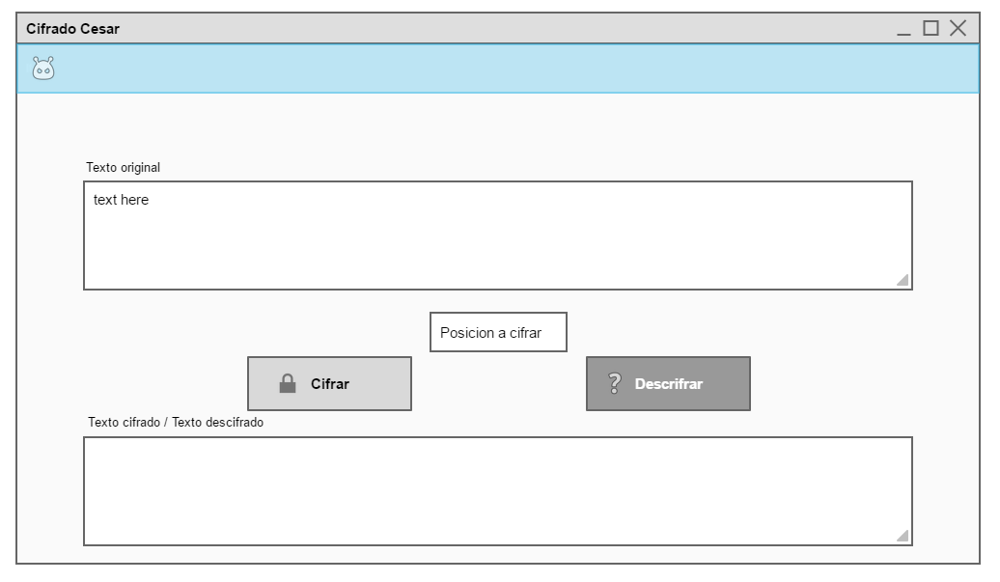
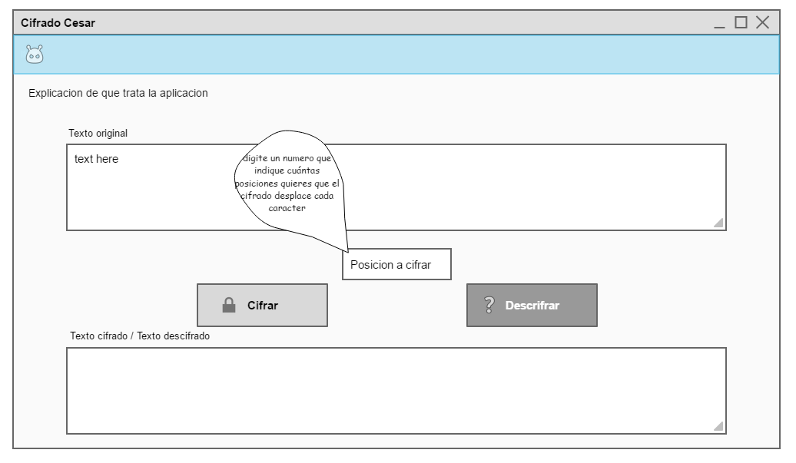
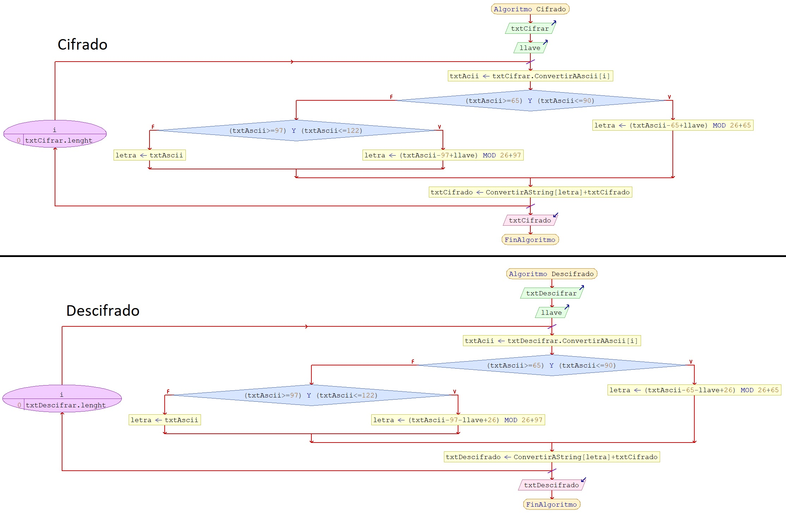
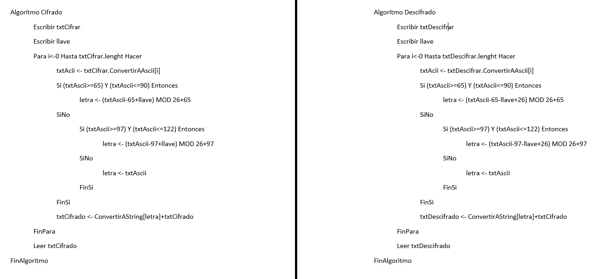

# <h1 style='color:#2490F4'>Caesar Cipher APP</h1>

## <h2 style='color:#68EEAD'>Introducción</h2>

Esta aplicación cifra mensajes del usuario con uno de los cifrados más conocidos, "CIFRADO CESAR". Estos mensajes no son entendibles a simple vista para ello, esta aplicación también te ayuda a descifrar los mensajes.

## <h2 style='color:#68EEAD'>DEMO</h2>

Entra a la aplicación web aquí -> <https://vbiaggi10.github.io/lim-2018-05-bc-core-pm-cipher/src/>

## <h2 style='color:#68EEAD'>Preámbulo</h2>

Si tu mamá no para de leer tus mensajes de WhastApp, de Facebook, de Instragram, de Twitter, hasta te encuentra en Tinder. Usa esta app, para cifrar tus mensajes privados, tu nombre en tinder, tus textos de amor, lo que sea que quieras ocultar y compártelo con tus amigos para que lo descifren con el **shift** que usaste.

## <h2 style='color:#68EEAD'>Producto</h2>

### <h3 style='color:#98ED06'>Desarrollo del producto</h3>

Para desarrollar el producto inicié haciendo un mockup base para presentar al usuario en la entrevista.

Luego realicé entrevistas a diferentes usuarios para poder llegar a una conclusión de como podría ser el producto.

*Para poder ver las entrevistas necesitas clonar el repositorio. El documento "Entrevista a usuarios" se encuentra dentro de la carpeta "Entrevistas"*

Despues llegué a una conclusión.

Para empezar a trabajar el producto comencé por la estructura básica del HTML con un estilo básico de CSS.

La segunda parte de la elaboración del producto fue hacer un DFD (Diagrama de Flujo de Datos) para el entendimiento del funcionamiento.

Luego procedí a realizar un algoritmo para luego poder plasmarlo en el lenguaje de programación correspondiente.

Después programé el funcionamiento y el objetivo del producto, en este caso cifrar y descifrar un texto y que el usuario indique el posicionamiento.

La tercera parte y última fue mejorar el CSS en un nivel más avanzado haciéndolo responsive y más agradable para el usuario.

El hacker edition fue culminado con éxito luego de todo el desarrollo del producto.

### <h3 style='color:#98ED06'>Objetivos del producto</h3>

Todos pueden usar este producto, ya que está diseñado para todo tipo de público alfabetizado; desde un menor de edad ,hasta un adulto mayor. Está indicado en el mismo producto los pasos que se deben realizar para usar correctamente el cifrado o descifrado de lo que el usuario desee.

El objetivo es que el usuario pueda cifrar o descifrar su mensaje sin ningún problema y con fácil entendimiento del producto, es por ello que el mismo producto tiene los pasos de como llevar a cabo su cometido.

Es por eso que éste producto resolverá todos sus problemas en cuanto a mandar un mensaje secreto y hasta poder revelarlo.

## <h2 style='color:#68EEAD'>Información</h2>

### <h3 style='color:#98ED06'>Contenido y Características</h3>

* Información
* Pasos para usar la aplicación
* Cifrador / Descifrador

## <h2 style='color:#68EEAD'>Instalación</h2>

Entra a la aplicación web aquí -> <https://vbiaggi10.github.io/lim-2018-05-bc-core-pm-cipher/src/>

## <h2 style='color:#68EEAD'>Tecnologías usadas</h2>

La aplicación está estructurada utilizando html, css,javascript.

## <h2 style='color:#68EEAD'>Cifrado Cesar</h2>

El [cifrado César](https://en.wikipedia.org/wiki/Caesar_cipher) es uno de los
primeros métodos de cifrado conocidos históricamente. Es un tipo de cifrado por
sustitución en el que una letra en el texto original es reemplazada por otra
letra que se encuentra un número fijo de posiciones más adelante en el alfabeto.

El emperador Julio César lo usaba para enviar órdenes a sus generales en los
campos de batalla, es una de las técnicas más simples y más usadas para cifrar
un mensaje.

Por ejemplo si usáramos un desplazamiento de 3:

* Alfabeto sin cifrar: A B C D E F G H I J K L M N O P Q R S T U V W X Y Z
* Alfabeto cifrado: D E F G H I J K L M N O P Q R S T U V W X Y Z A B C

Actualmente todos los cifrados de sustitución alfabética simple, se descifran
con facilidad y en la práctica no ofrece mucha seguridad en la comunicación,
pero el cifrado César muchas veces puede formar parte de sistemas más complejos
de codificación, como el cifrado Vigenère, e incluso tiene aplicación en el
sistema ROT13.